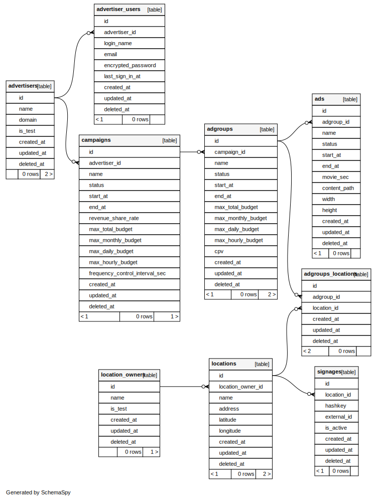

# migrations

DB 移行の際の DDL 等を格納するディレクトリです。

## 移行後の DB スキーマ

### スキーマ検討時の議事録

- 旧環境の DB スキーマを精査し、移行後のスキーマ構成を検討した際の議事録は下記 esa に記載しています。
  - https://lodeo.esa.io/posts/1590

### ER 図

- 移行後のデータベーススキーマは schemaspy を使用して、生成しています。
  

## DDL, DML

テーブルを定義するなどの DDL は schema/ ディレクトリへ、
データを流し込むなどの DML は test-data/ ディレクトリへ各定義ファイルを追加します。
それぞれへのファイルの追加方法は以下の通りです。

```
$ sqlx migrate add -r <name> --source schema    
$ sea-orm-cli migrate generate <name> -d ./schema // <name>の例: create_locations_table
$ sea-orm-cli migrate generate <name> -d ./test-data // <name>の例: insert_locations_table
```

生成されたファイルに、他ファイルの記述を参考にして、upメソッドと、それに対応するdownメソッドを実装してください。
